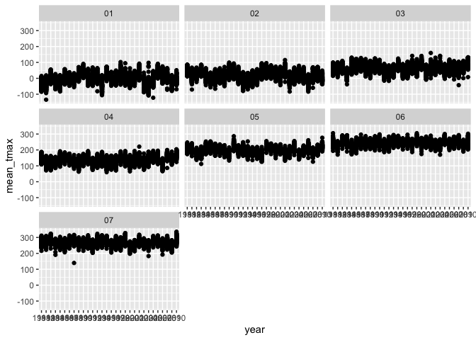

8105_hw3_yc4585
================
2024-10-15

``` r
library(p8105.datasets)
library(readr)
library(dplyr)
library(tidyr)
library(ggplot2)
```

# Problem 1

``` r
data("ny_noaa")
prcp_missing = ny_noaa[is.na(ny_noaa$prcp), ]
snow_missing = ny_noaa[is.na(ny_noaa$snow), ]
snwd_missing = ny_noaa[is.na(ny_noaa$snwd), ]
tmax_missing = ny_noaa[is.na(ny_noaa$tmax), ]
tmin_missing = ny_noaa[is.na(ny_noaa$tmin), ]
```

This dataset has 2595176 rows and 7 columns,the main variables includes
id, date, prcp, snow,snwd,tmax amd tmin. The prcp has 145838 missing
values, snow column has 381221 missing values

``` r
ny_noaa  |>
  janitor::clean_names() |>
  separate(date, into = c("year", "month","day"), sep = "-") 
```

    ## # A tibble: 2,595,176 × 9
    ##    id          year  month day    prcp  snow  snwd tmax  tmin 
    ##    <chr>       <chr> <chr> <chr> <int> <int> <int> <chr> <chr>
    ##  1 US1NYAB0001 2007  11    01       NA    NA    NA <NA>  <NA> 
    ##  2 US1NYAB0001 2007  11    02       NA    NA    NA <NA>  <NA> 
    ##  3 US1NYAB0001 2007  11    03       NA    NA    NA <NA>  <NA> 
    ##  4 US1NYAB0001 2007  11    04       NA    NA    NA <NA>  <NA> 
    ##  5 US1NYAB0001 2007  11    05       NA    NA    NA <NA>  <NA> 
    ##  6 US1NYAB0001 2007  11    06       NA    NA    NA <NA>  <NA> 
    ##  7 US1NYAB0001 2007  11    07       NA    NA    NA <NA>  <NA> 
    ##  8 US1NYAB0001 2007  11    08       NA    NA    NA <NA>  <NA> 
    ##  9 US1NYAB0001 2007  11    09       NA    NA    NA <NA>  <NA> 
    ## 10 US1NYAB0001 2007  11    10       NA    NA    NA <NA>  <NA> 
    ## # ℹ 2,595,166 more rows

``` r
ny_noaa |>
  count(snow) |>
  arrange(desc(n))
```

    ## # A tibble: 282 × 2
    ##     snow       n
    ##    <int>   <int>
    ##  1     0 2008508
    ##  2    NA  381221
    ##  3    25   31022
    ##  4    13   23095
    ##  5    51   18274
    ##  6    76   10173
    ##  7     8    9962
    ##  8     5    9748
    ##  9    38    9197
    ## 10     3    8790
    ## # ℹ 272 more rows

0 is the most commonly observed value, because 0 means no snow and in
New York, the days of no snow is more than the days snow.

### plot of average tmax

``` r
tmax_plot=
ny_noaa |>
  separate(date, into = c("year", "month","day"), sep = "-")  |>
  group_by(id,year,month) |>
  filter(month=="01"|month=="02"|month=="03"|month=="04"|month=="05"|month=="06"|month=="07") |>
  summarise(mean_tmax = mean(as.numeric(tmax),na.rm = TRUE)) |>
  ggplot(aes(x = year,y = mean_tmax)) +
  geom_point() +
  facet_wrap(~month)
```

    ## `summarise()` has grouped output by 'id', 'year'. You can override using the
    ## `.groups` argument.

``` r
print(tmax_plot)
```

    ## Warning: Removed 20807 rows containing missing values or values outside the scale range
    ## (`geom_point()`).

<!-- -->

\`\`\`
